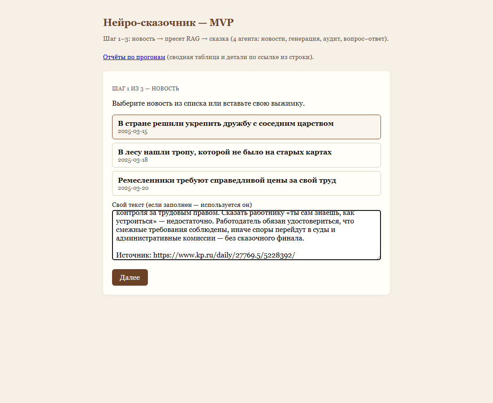
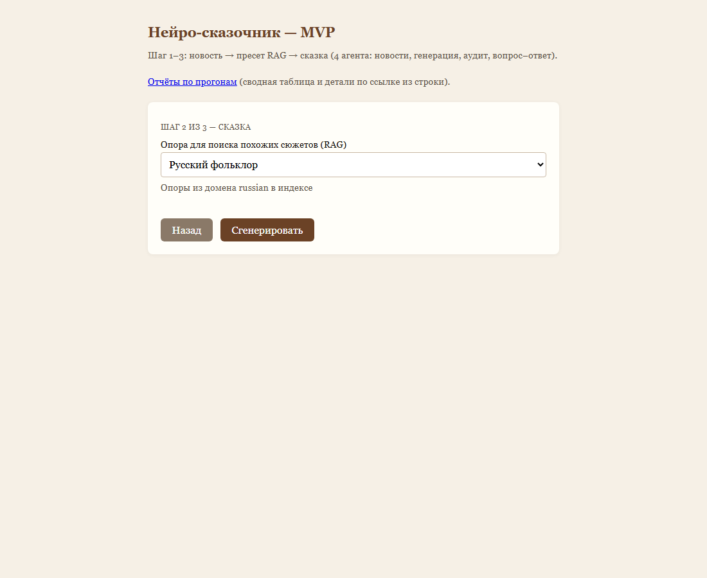
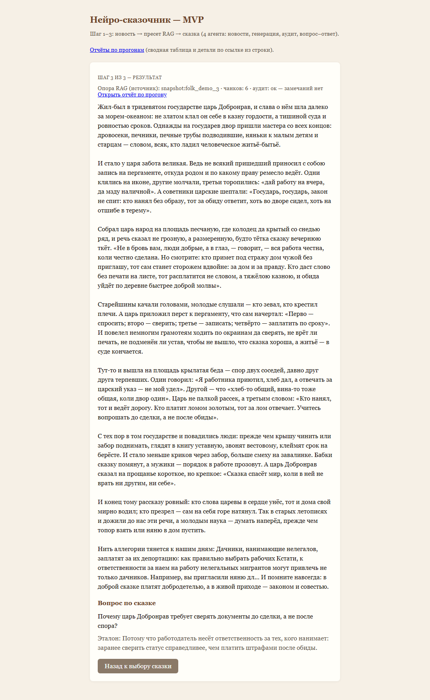
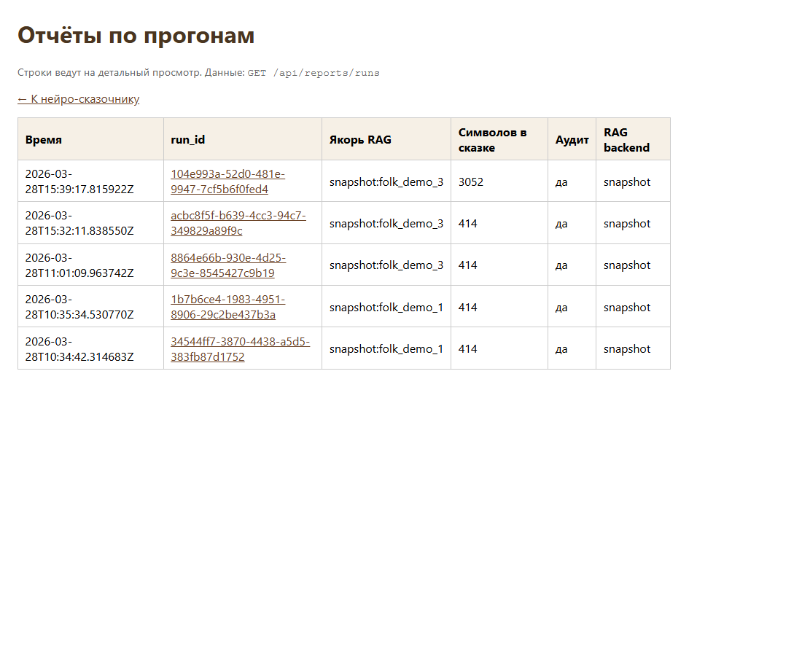
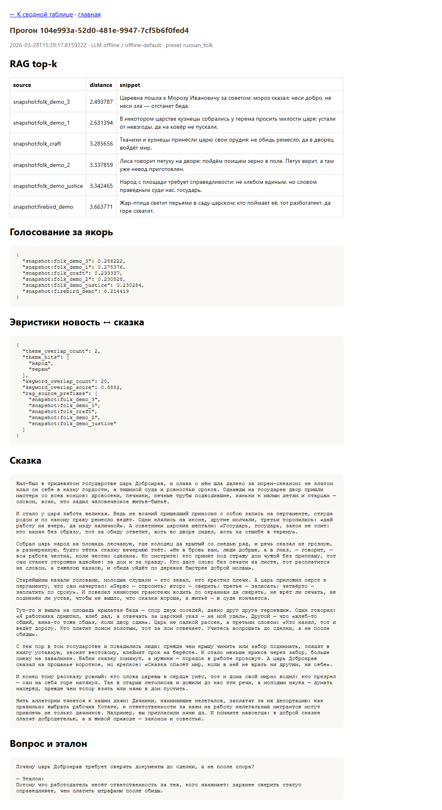

# Пайплайн «нейро-сказочник»: HTTP API, вызовы агентов, скриншоты

Документ описывает **публичные HTTP-методы**, последовательность **четырёх
LLM-агентов** и шаг **RAG** внутри одного прогона, а также даёт **расширенный
текст новости** и **пример длинной сказки** (офлайн-режим без внешнего API).

Исходный текст новости для автозахвата интерфейса совпадает с файлом
[`pipeline_walkthrough_news.txt`](pipeline_walkthrough_news.txt) и подставляется
скриптом `scripts/capture_e2e_screenshots.py`.

---

## 1. Исходная новость (длинный текст)

```text
Дачники, нанимающие нелегалов, заплатят за их депортацию: как
правильно выбрать рабочих

Кстати, к ответственности за наем на работу нелегальных мигрантов
могут привлечь не только дачников. Например, вы пригласили няню для
присмотра за детьми или пожилыми родственниками, наняли плиточника или
штукатура, чтобы сделать ремонт в квартире или частном доме — во всех
этих случаях вы становитесь работодателем и несете ответственность и за
себя, и за тех, кого пригласили.

Юристы напоминают: формальный договор и копии документов не
освобождают от проверки законности пребывания наемных работников.
Если у иностранца нет разрешения на труд, штрафы и расходы на выдворение
могут лечь на того, кто организовал работу и оплату. На практике это
касается не только крупных компаний, но и частных бригад на даче:
от покоса травы до возведения теплицы.

Как снизить риски. Спросите у кандидатов патент, разрешение или иной
законный статус и сверьте данные через официальные сервисы. Храните
сканы с согласия исполнителя, фиксируйте даты и объём работ. При
сомнениях лучше обратиться в юрконсультацию или нанять бригаду через
организацию с лицензией: тогда ответственность за кадры распределена
явно. Помните: экономия на «серых» схемах часто оборачивается
десятикратными расходами и испорченным соседским миром.

В ведомствах подчеркивают: гражданская солидарность не отменяет
контроля за трудовым правом. Сказать работнику «ты сам знаешь, как
устроиться» — недостаточно. Работодатель обязан удостовериться, что
смежные требования соблюдены, иначе споры перейдут в суды и
административные комиссии — без сказочного финала.

Источник: https://www.kp.ru/daily/27769.5/5228392/
```

---

## 2. Публичный HTTP API (оболочка)

Отдельных URL «на каждого агента» нет: все четыре вызываются из одного
запроса **`POST /api/generate`** в `app.main`.

| Метод | Назначение |
|-------|------------|
| `POST /api/generate` | Полный прогон: новости → RAG → сказка → аудит → Q&A |
| `GET /api/reports/runs` | Список сохранённых прогонов |
| `GET /api/reports/runs/{run_id}` | JSON отчёта (RAG top-k, эвристики, сказка) |
| `GET /api/health` | Проверка живости сервера |
| `GET /api/news` | Список примеров новостей для UI |
| `GET /api/tale-presets` | Пресеты RAG для UI |

### Пример: запуск пайплайна

Текст новости удобнее передавать из файла (тело не обрезается в
терминале из-за длины):

```bash
# Bash: подставить содержимое файла в JSON (или собрать тело вручную)
curl -s -X POST "http://127.0.0.1:8000/api/generate" \
  -H "Content-Type: application/json" \
  -d "$(python -c "
import json, pathlib
p = pathlib.Path('docs/pipeline_walkthrough_news.txt')
body = {'news_text': p.read_text(encoding='utf-8').strip(),
        'preset_id': 'russian_folk'}
print(json.dumps(body, ensure_ascii=False))
")"
```

Минимальное тело запроса (поля модели `GenerateRequest` в `app.main`):

- **`news_text`** (строка, до 8000 символов) **или** **`news_id`** из
  `GET /api/news`;
- **`preset_id`** — например `russian_folk`.

Ответ содержит `tale`, `news_brief`, `chosen_tale_source`,
`rag_chunks_used`, `audit`, `qa`, при включённом сохранении отчётов —
`run_id` и `report_detail_url`.

### Пример: получить сохранённый отчёт

```bash
curl -s "http://127.0.0.1:8000/api/reports/runs/<run_id>"
```

---

## 3. Внутренняя цепочка: RAG и четыре вызова LLM

Реализация: `app.agents_pipeline.run_four_agent_pipeline`; провайдер —
`LLMProvider` (`app.llm_providers`): методы `chat_json_object` и
`chat_text`.

### Шаг 0 — нормализация текста

- `normalize_news_text(news_text)` (`app.story_service`).

### Шаг A — RAG (не LLM)

После агента новостей строится `rag_query` (подсказка пресета, ключевые
слова, темы, сводка). Дальше:

- **`FAIRYNEWS_RAG_BACKEND=snapshot`** —
  `retrieve_plot_records_from_snapshot` (`rag/snapshot_retrieve.py`),
  векторизация запроса, **k = 15**;
- иначе — `retrieve_plot_records` (Chroma).

Выбирается якорный источник (`_pick_primary_source`), в промпт сказки
попадает блок опорных фрагментов.

### Агент 1 — «Новости» (сжатие в JSON)

| | |
|---|---|
| **Метод API провайдера** | `chat_json_object` |
| **temperature / max_tokens** | 0.2 / 1200 |

**System** (смысл):

> Ты агент новостей. Сожми вход в JSON: summary (строка), themes (массив
> 2–5 строк), retrieval_keywords (одна строка для поиска похожих сказок,
> по-русски).

**User:** `Новость:\n` + нормализованный текст.

**Ожидаемые поля ответа:** `summary`, `themes`, `retrieval_keywords`.

### Агент 2 — «Сказка» (длинный текст)

| | |
|---|---|
| **Метод** | `chat_text` |
| **temperature / max_tokens** | 0.85 / 3500 |

**System:** оригинальная русская народная стилистика, метафора новости,
без дословного копирования RAG.

**User:** структурированная новость (сводка + темы), блок опорных сказок
из RAG с указанием источника, инструкция о объёме (~600–1200 слов).

### Агент 3 — «Аудит» (JSON)

| | |
|---|---|
| **Метод** | `chat_json_object` |
| **temperature / max_tokens** | 0.2 / 1200 |

**System:** проверка связности, сказочного стиля, отсутствия прямой
политической агитации; ответ JSON с `approved`, `notes`, `tale`
(исправленный текст или пусто).

**User:** сводка новости + черновик сказки.

Итоговый текст: исправленный `tale`, если непустой, иначе черновик.

### Агент 4 — «Вопрос–ответ» (JSON)

| | |
|---|---|
| **Метод** | `chat_json_object` |
| **temperature / max_tokens** | 0.4 / 900 |

**System:** один вопрос по сказке и эталонный ответ; JSON:
`question`, `reference_answer`.

**User:** финальный текст сказки.

После этого считаются эвристики (`app.heuristics`), в ответ клиенту
кладётся словарь `report` для сохранения на диск (если не отключено).

---

## 4. Пример финальной сказки (офлайн-режим)

Ниже — текст, получаемый при **`FAIRYNEWS_LLM_MODE=stub`** (или без
`OPENAI_API_KEY`): детерминированный шаблон в `app.llm_providers`.
При работе через OpenAI объём и формулировки будут иными, но цепочка
вызовов та же.

```text
Жил-был в тридевятом государстве царь Добронрав, и слава о нём шла далеко за морем-океаном: не златом клал он себе в казну гордости, а тишиной суда и ровностью сроков. Однажды на государев двор пришли мастера со всех концов: дровосеки, печники, печные трубы подводившие, няньки к малым детям и старцам — словом, всяк, кто ладил человечское житьё-бытьё.

И стало у царя забота великая. Ведь не всякий пришедший приносил с собою запись на пергаменте, откуда родом и по какому праву ремесло ведёт. Одни клялись на иконе, другие молчали, третьи торопились: «дай работу на вчера, да мзду наличной». А советники царские шептали: «Государь, государь, закон не спит: кто нанял без образу, тот за обиду ответит, хоть во дворе сидел, хоть на отшибе в терему».

Собрал царь народ на площадь песчаную, где колодец да крытый со снедью ряд, и речь сказал не грозную, а размеренную, будто тётка сказку вечернюю ткёт. «Не в бровь вам, люди добрые, а в глаз, — говорит, — вся работа честна, коли честно сделана. Но смотрите: кто примет под стражу дом чужой без приглашу, тот сам станет сторожем вдвойне: за дом и за правду. Кто даст слово без печати на листе, тот расплатится не словом, а тяжёлою казною, и обида уйдёт по деревне быстрее доброй молвы».

Старейшины качали головами, молодые слушали — кто зевал, кто крестил плечи. А царь приложил перст к пергаменту, что сам начертал: «Перво — спросить; второ — сверить; третье — записать; четвёрто — заплатить по сроку». И повелел немногим грамотеям ходить по окраинам да сверять, не врёт ли печать, не подменён ли устав, чтобы не вышло, что сказка хороша, а житьё — в суде кончается.

Тут-то и вышла на площадь крылатая беда — спор двух соседей, давно друг друга терпевших. Один говорил: «Я работника приютил, хлеб дал, а отвечать за царский указ — не мой удел». Другой — что «хлеб-то общий, вина-то тоже общая, коли двор один». Царь не палкой рассек, а третьим словом: «Кто нанял, тот и ведёт дорогу. Кто платит ломом золотым, тот за лом отвечает. Учитесь вопрошать до сделки, а не после обиды».

С тех пор в том государстве и повадились люди: прежде чем крышу чинить или забор поднимать, глядят в книгу уставную, звонят вестовому, клеймят срок на берёсте. И стало меньше криков через забор, больше смеху на завалинке. Бабки сказку помянут, а мужики — порядок в работе прозовут. А царь Добронрав сказал на прощанье короткое, но крепкое: «Сказка спасёт мир, коли в ней не врать ни другим, ни себе».

И конец тому рассказу ровный: кто слова царевы в сердце унёс, тот и дома свой мирно водил; кто презрел — сам на себя горе натянул. Так в старых летописях и дожили до нас эти речи, а молодым наука — думать наперёд, прежде чем топор взять или няню в дом пустить.

Нить аллегории тянется к нашим дням: Дачники, нанимающие нелегалов, заплатят за их депортацию: как правильно выбрать рабочих Кстати, к ответственности за наем на работу нелегальных мигрантов могут привлечь не только дачников. Например, вы пригласили няню дл… И помните навсегда: в доброй сказке платят добродетелью, а в живой приходе — законом и совестью.
```

---

## 5. Скриншоты веб-интерфейса

Снято Playwright-скриптом `scripts/capture_e2e_screenshots.py` (три шага
MVP + сводка отчётов + деталка). Пути указаны **от корня репозитория**.











Краткий перечень файлов см. в [`e2e_screenshots/SCREENSHOTS.md`](../e2e_screenshots/SCREENSHOTS.md).
